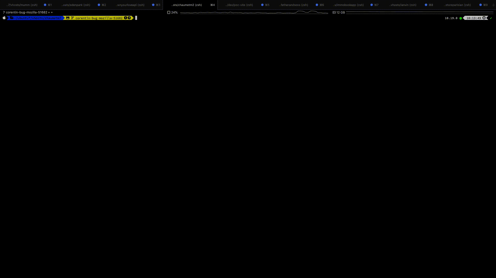

# Petit script pour créer une merge request depuis le terminal !



## Node version used 16.17.0

## Config

__Créer un fichier .env à la racine de votre home directory__

```sh
cd ~ && mkdir cli-mr-creator && cd cli-mr-creator && touch .env
```

Rajouter votre token Gitlab et c'est parti
__Env file__
```
TOKEN=
```

Afin d'avoir une liste de personnes pour review vos MR il faut rajouter dans le fichier .env le nom de votre groupe de développeurs.

__Env file__
```
TOKEN=
DEV_GROUP=
```

## Redmine

J'utilise Redmine pour la gestion des tickets. Si vous voulez que dans la description de la merge request vous y trouviez automatiquement un lien vers votre ticket il suffit d'écrire l'id de votre issu à la fin de votre nom de branche.

Exemple :
```
great-feature-30499 -> https://url.redmine.fr/issues/30499
```

## Utiliser le script

```sh
# Installer le script en local
npm i cli-mr-creator

# Ou bien en global
npm i -g cli-mr-creator

# Et ensuite
cli-mr-creator

# Ou bien simplement lancer le script avec npx
npx cli-mr-creator
```

# TODO
- Refactor call api in order
- Traduction : FR / EN